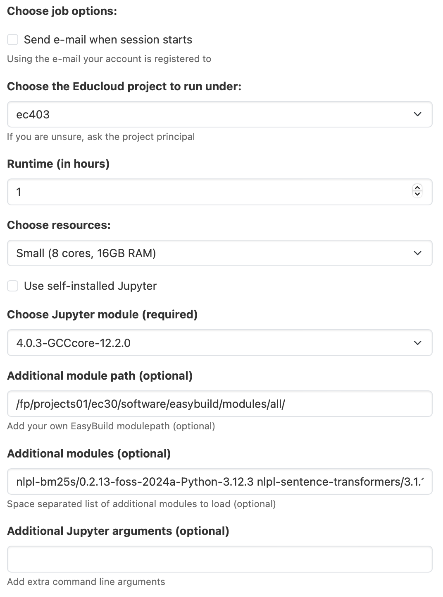

### Fox description

Please create a Jupyter notebook as shown below:



#### Modules

Please find the list of recommended modules below:

```nlpl-bm25s/0.2.1-foss-2022b-Python-3.10.8 nlpl-sentence-transformers/3.1.1-foss-2022b-Python-3.10.8 nlpl-transformers/4.47.1-foss-2022b-Python-3.10.8 nlpl-transformers/4.47.1-foss-2022b-Python-3.10.8 nlpl-llmtools/06-foss-2022b-Python-3.10.8 nlpl-nlptools/04-foss-2022b-Python-3.10.8 nlpl-huggingface-hub/0.27.1-foss-2022b-Python-3.10.8```

#### Module path 

```/fp/projects01/ec30/software/easybuild/modules/all/```

#### Alternative Modules if you are not using huggingface hub

```nlpl-sentence-transformers/3.1.1-foss-2022b-Python-3.10.8 nlpl-transformers/4.47.1-foss-2022b-Python-3.10.8 nlpl-nlptools/04-foss-2022b-Python-3.10.8 nlpl-bm25s/0.2.1-foss-2022b-Python-3.10.8 ```
